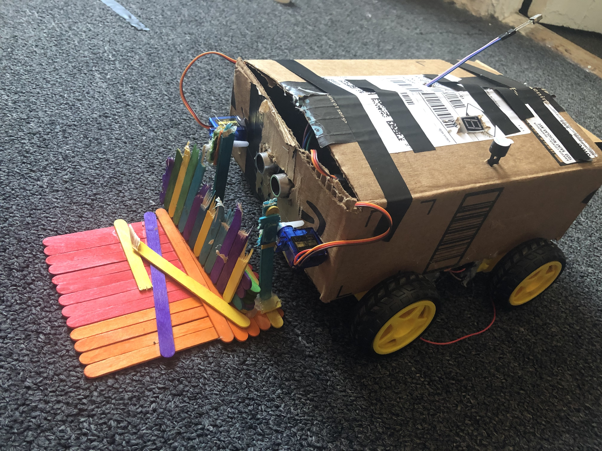

# Final Project: Amazon Delivery Bot

## Sources:
Go to https://git.io/JTz3m to download the master file. 

The following was used for the motor controls: 
https://create.arduino.cc/projecthub/ryanchan/how-to-use-the-l298n-motor-driver-b124c5

Sketch_23.1_Infrared_Remote_Control example sketch of the master file was used for the infrared controller

Sketch_16.1_1_Digit_7-Segment_Display example sketch was used for the 7-segment display

Sketch_21.2_Ultrasonic_Ranging example sketch was used for the ultrasonic sensor

The documentation for All sources of code is found in this pdf file:  Freenove_Ultimate_Starter_Kit_for_ESP32-master\Freenove_Ultimate_Starter_Kit_for_ESP32-master\C\C_Tutorial

## What is it?

This is an RC car that is geared for deliveries that I call the Amazon delivery bot. It is controlled by a wireless remote controller and is powered by three 9V batteries. The car is able to pick up and drop packages by a crane mechanism in the front of the robot.

## Using the Infrared Remote Controller
The following buttons on the Infrared Remote controller do the following actions to the robot.

  - Power: Pressing power toggles find mode on and off. During find mode, the robot would move continously right until it senses an object that is in front of it within 9 inches. At that point it would stop.
  - Reverse: Move left continously.
  - Forward: Move right contnously. 
  - Plus: Move forward continously.
  - Minus : Move backward continously.
  - Play: Stop rc bot.
  - 0 : Drop the crane.
  - C: Lift the crane.
  - 4: Sudden burst of movement to the left.
  - 2: Sudden burst of movement forward.
  - 6: Sudden burst of movement to the right.
  - 8: Sudden burst of movement backward

## Installation 
Go to manage libraries in Arduino IDE and install the following libraries:

  - UltrasonicSensor
  - IRremoteESP8266  
  - ESP32Servo 

## Setting up Wiring

Components used:

  - ESP32-WROVER
  - GPIO Extension Board for esp32
  - 2  L298N Motor Drive Controller Boards
  - 4 TT Motors
  - 4 Smart Car Wheels
  -  (NOTE: The previous 3 items can be found here: https://www.amazon.com/gp/product/B07ZT619TD/ref=ppx_yo_dt_b_asin_title_o01_s00?ie=UTF8&psc=1&tag=techblast0f-20)
  -  2 Servos
  -  7-Segment Display
  -  piezo buzzer
  -  Ultrasonic Sensor
  -  74HC595
  -  8 220 Ohm Resistors
 
For the specific wiring, here is the digital connection layout for all the components:
Esp32:

    - Connect a 9v battery into the dedicated port on the extension board to power the esp32. 
    - Connect the VCC and GND of the Ultra sonic sensor to GND and 5v on the esp32. Connect the Trig pin to pin 12 and the Echo pin to pin 14.
    - Connect all 3 car wheels to all 4 TT motors. 
    - For the back 2 wheels, connect them to a L298N motor drive controller board. Connect the power and ground of these motors to each of the sides of the motor drive. Connect the power of the drive to a 9v battery and the GND of the drive into the 9V batttery AND into the esp32 as well. Connect the IN1, IN2, IN3, and IN4 pins to pins 22,23,18,19 respectively.
    - Repeat the exact same wiring for the the remaining wheels and L298N motor drive controller board as previously mentioned for the top right and top left wheels. The only difference is that you must connect the IN1, IN2, IN3, and IN4 pins to pins 27,26,25,33. Like previously, make sure this is also powered by a 9v battery. 
    - Connect the GND of the ultrasonic to GND of the esp32 and the other pin to pin 13 on the esp32. 
    - For the servos, set both the VCC and GND for both of them into the GND pin and v5 pin of the esp32. Set the signal pin for the left servo to pin 5 and the right servo to pin 21.
    - For the 74HC595, 7 segment display, and the resistors, please see page 168 on the C_tutorial.pdf file attached in the repo. The pdf file is the same file also mentioned on the last line of the sources section. The only difference in this layout is you need to make sure to use. The following image is the page in reference to quickly see the circuti:
    - 

## Running the Program

Just click upload on the arduino IDE. 

## More Documentation

The code has been very well documented through comments. See for more info. 

## Demo:
https://www.youtube.com/watch?v=p9yMJDwOi4E&t=2s&ab_channel=AhmedAlzubairi
## Bugs:
Here are some of the bugs I noticed and possible fixes:
    - If you ever encounter a huge deplay in the reaction of the controller, it is most likely due to delays you implemented into the code. 
    - If the robot seems to be running really slow or acting weird in its reaciton, it is most likely due to power. A fix I found was using three 9V batteries as mention. 2 to power the motor drivers and 1 to power the esp32. Make sure good enough power is given to the esp32. Also make sure there is a common ground between the motor drivers and the esp32. This is why I mentioned to connect the gnd of the motor drivers into the gnd of the esp32 as well.
    - If you encounter sitautions where your readings are really off or some of your sensors aren't working as shown, it is most likely due to the pin locations. Some pins on the esp32 have dedicated use cases and that may impact its functionality. To minmize these issues, use the exact same pin layout as I have.

